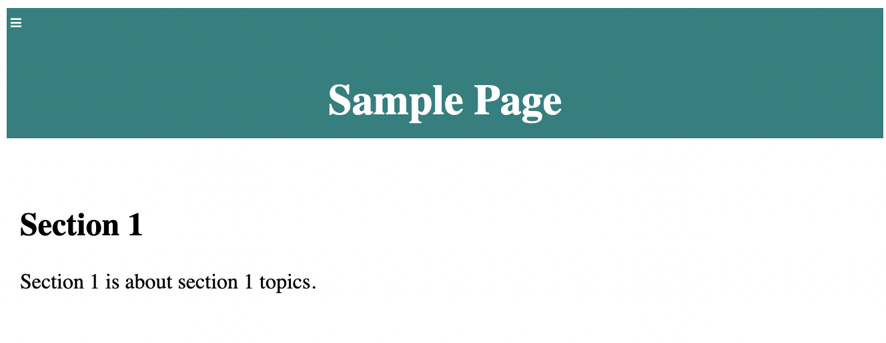

# HTML Practice

https://cbarber1984.github.io/simple_page/

After spending several weeks working through the freeCodeCamp modules for algorithmic scripting, object oriented programming, and functional programming, I decided to build a simple HTML site with some JavaScript functions to reveal and hide the navigation panel on the left hand side of the page.

## To-Do List:
- Use CSS to style elements
    - When the navbar is visible, the main content moves over as expected but also moves down. This is not my intention. I need to isolate what display properties are causing this unintended consequence.
    - I think that animating the position of the elements will be more visually appealing than changing the view percentage via JavaScript.
- Practice integrating Visual Studio Code and GitHub to manage local changes to the code and the repo here.
